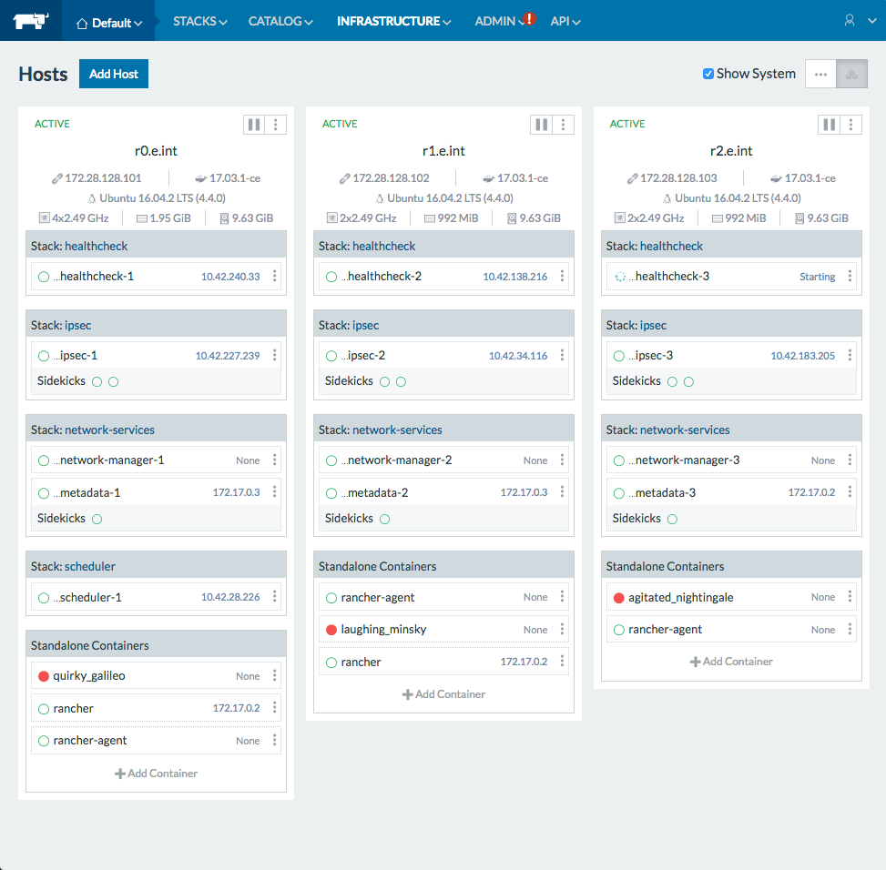

# Rancher

[](https://travis-ci.org/jongillies/rancher.svg?branch=master  )

This repository contains the scripts, documentation and logic to prepare a self bootstrapping [Rancher](http://rancher.com/) cluster.

#### Install the Following

* [VirtualBox](https://www.virtualbox.org/wiki/VirtualBox) >= 5.1.14
* [VirtualBox Extension Pack](https://www.virtualbox.org/wiki/Downloads) Should match VirtualBox version
* [Vagrant](https://www.vagrantup.com/) >= 1.9.3
    * [vagrant-hostmanager](https://github) >= 1.8.5.com/devopsgroup-io/vagrant-hostmanager)
    * [vagrant-vbguest](https://github.com/dotless-de/vagrant-vbguest) >= 0.13.0
    * [vagrant-share](https://www.vagrantup.com/docs/share/) >= 1.1.7
* [Ansible](https://www.ansible.com/) >= 2.2.1.0_2

Once Vagrant is installed, install the necessary plugins:

```bash
./install_vagrant_plugins.sh
```

## Run Rancher

NOTE: You will have to enter your password for the `vagrant-hostmanager` to update your local `/etc/hosts` file.

I usually just change the ownership of the `/etc/hosts` file like: `sudo chown $USER /etc/hosts`, then I don't have to enter the password.

We are going to bring up just one node and not provision it.

```bash
$ vagrant up r0.e.int --no-provision
```

Then you should be able to SSH to the box:

```
$ vagrant ssh r0.e.int
Welcome to Ubuntu 16.04.2 LTS (GNU/Linux 4.4.0-66-generic x86_64)

 * Documentation:  https://help.ubuntu.com
 * Management:     https://landscape.canonical.com
 * Support:        https://ubuntu.com/advantage
Last login: Thu Mar 23 10:05:18 2017 from 10.0.2.2

ubuntu@r0.e.int:~$
```

This validates we have our environment setup properly and are ready to proceed.

## Vagrantfile

The `Vagrantfile` reads a data file called `nodes.yml`.  The following VMs are defined:

| Private IP     | Hostname | Base Box        | Description          |
|:---------------|:---------|:----------------|:---------------------|
| 172.28.128.101 | r0.e.int | ubuntu/xenial64 | Rancher Server/Agent |
| 172.28.128.102 | r1.e.int | ubuntu/xenial64 | Rancher Agent        |
| 172.28.128.103 | r2.e.int | ubuntu/xenial64 | Rancher Agent        |

## Rancher Server Setup

The `r0.e.int` VM is up, so let's provision it and get Rancher Server installed.

```bash
vagrant provision r0.e.int
```

You can then navigate to [r0.e.int](http://r0.e.int:8080)

Bam!  You have a Rancher Server running.

## Cluster Setup

Now run `vagrant up` to bring up the rest of the nodes.




Navigate to here to look at the infrastructure: http://r0.e.int:8080/env/1a5/infra/hosts

## Behind the Scenes

Three variables are defined that control what is installed:

* install_rancher_server: yes
* install_ranger_agent: yes
* rancher_agent_version: 1.2.1

Also defined must be:

* rancher_server
* rancher_port

Above are the defaults for those settings.

The settings are customized in the `nodes.yml` so that the Rancher Server is only installed on `r0.e.int` and the Rancher Agent is installed on all 3 nodes.

For the Rancher Agent to successfully install, the Ranger Server must be running first.  This is because the agent needs to obtain the registration information via the API.

The `tasks/rancher-agent.yml` obtains the following information in this order:

* Gets the default project_id
* Using the project_id it gets the rancher_token_url
* Using the rancher_token_url it gets rancher_token
* Runs the rancher-agent container using the rancher_token_url and the rancher_token, this "registers" the agent with the Rancher Server.

# Troubleshooting

If you get into a situation where the VirtualBox tools don't install properly, make sure you have the latest Extension Pack installed.  If  you run the VirtualBox GUI, it will prompt you to install if they are out of date.

Or, if that is not working set this to false in the `Vagrantfile`:

```ruby
config.vbguest.auto_update = false
````
